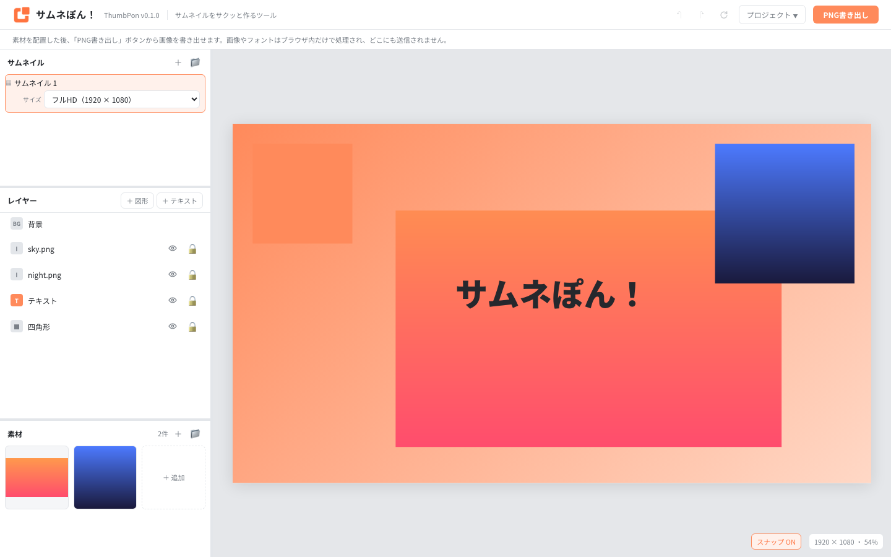

# サムネぽん / ThumbPon (開発中)


画像やテキストなどの素材を配置し、**サムネイル画像を効率よく制作する**ためのWebツールです。

DCCツールを毎回開かずに、シンプルなレイアウトの画像をサクッと作ることを目的にしています。<br>
自由度よりも、速さ・軽さ・操作の少なさを優先しています。

読み込み・編集・保存・書き出しはすべてブラウザ内で完結し、画像やフォントは**サーバーに送信されません**。<br>

## できること

- 複数のサムネイルを作成し、フォルダで整理する
- 画像・テキスト・背景をキャンバスへ配置して編集する
- レイヤーの移動、拡大縮小、回転、クロップ、重なり順の変更
- ローカル素材・フォント・テキスト／背景プリセットの再利用
- 実寸 PNG の書き出しと、`.thumbpon.zip` プロジェクトの入出力
- Chromium 系ブラウザでのローカルフォルダ保存

## 画面構成



- **サムネイル**: 制作物ごとの切替、追加、フォルダ整理、キャンバスサイズの変更
- **レイヤー**: 背景・画像・テキストの選択、並び替え、詳細編集
- **素材**: 画像の登録とフォルダ整理
- **キャンバス**: 配置・リサイズ・回転・クロップなどの直接操作

## 基本的な使い方

### サムネイル編集・画像書き出し

#### 1. サムネイルを選び、サイズを決める

- 左上の「サムネイル」パネルで、編集するサムネイルを選びます。
- 必要なら `＋` で追加し、選択中の行からキャンバスサイズを `1920 × 1080` または `800 × 600` に変更します。

#### 2. 素材を追加する

- **画像**: 画像ファイルをキャンバスへドラッグ&ドロップします。素材パネルの画像は、クリックで中央に、ドラッグで任意の位置に配置できます。
- **テキスト**: 「レイヤー」パネルの `＋ テキスト` を押し、追加したレイヤーのプロパティで内容やフォント、サイズ、色を設定します。
- **図形**: 「レイヤー」パネルの `＋ 図形` を押し、追加したレイヤーのプロパティで形や塗りを設定します。

#### 3. 配置と見た目を整える

- キャンバス上でレイヤーをドラッグして動かします。
- 選択枠のハンドルで大きさや回転を調整し、レイヤー一覧をドラッグして前後関係を変更します。
- 背景は一覧最上部の `BG 背景` から編集します。

#### 4. 画像を書き出す

- PNGファイルとしての書き出しをサポートしています。
- 完成したら画面右上の `PNG書き出し` を押します。表示倍率に関係なく、キャンバス実寸の PNG がダウンロードされます。

### プロジェクトの保存

プロジェクトの保存方法として、次の2つを用意しています。

- **ローカルフォルダを指定して保存する**
  - 作業フォルダへ直接保存し、次回もそのフォルダを開いて再開する方法
  - こちらの機能は、Chrome / Edge など Chromium 系ブラウザでのみ使えます。
- **エクスポート／インポートする**
  - `.thumbpon.zip` ファイルとして保存し、ファイルから再開する方法

#### ローカルフォルダを指定して保存する（Chromium 系のみ）

1. 「プロジェクト」→「プロジェクトを保存」を選びます。初回だけ保存先のフォルダを選択します。
2. 次回からは `Ctrl` / `⌘` + `S` でも、同じフォルダへ保存できます。
3. 作業を再開するときは、「プロジェクト」→「プロジェクトを開く」で保存先のフォルダを選びます。

#### エクスポート／インポートする

1. 「プロジェクト」→「エクスポート」を選び、`.thumbpon.zip` をダウンロードします。
2. 作業を再開するときは、「プロジェクト」→「インポート」からそのファイルを読み込みます。

## 詳しい使い方

### サムネイルと素材の整理

1枚の制作物が「サムネイル」です。複数作成してフォルダで分類できます。

| 操作 | 方法 |
| --- | --- |
| 切り替え | 行をクリック |
| 名前変更 | 行をダブルクリック |
| 追加 | パネル右上の `＋`。フォルダ行の `＋` ならそのフォルダ内へ追加 |
| 複製 | 行にホバーして `⧉` |
| コピー／貼り付け | 行の `📋` でコピーし、パネル右上またはフォルダ行の `📥` で貼り付け |
| フォルダへ移動 | 行をフォルダへドラッグ |
| 削除 | 行の `🗑`。削除後はひとつ上のサムネイルへ移動 |

キャンバスサイズはサムネイルごとに保持します。選択中の行の下にある `サイズ` から変更してください。

画像はキャンバスへの直接ドロップ、または素材パネルから追加します。対応する主な形式は PNG、JPEG、WebP、SVG です。素材は IndexedDB に保存されるため、リロード後も残ります。

素材もフォルダで分類できます。パネル右上の `📁` でフォルダを追加し、素材タイルをドラッグして入れます。フォルダを削除しても中の素材は未分類へ戻るだけで、画像自体は消えません。素材フォルダの分類は、プロジェクトを書き出したときの `assets/` 内のフォルダ構成にも反映されます。

### クロップと左右反転

画像レイヤーは表示する範囲を切り詰められます。<br>
切り落とす量は割合で持つため、レイヤーを拡大縮小してもクロップは崩れません。

- プロパティの `枠で調整` を押すと、キャンバス上で8つのハンドルを使って枠を内側へ詰められます。画像の中身は動かず、切り落とす部分だけが薄く表示されます。
- `上/下/左/右を切る` のスライダーでも調整できます。`解除` で画像全体へ戻ります。
- レイヤー一覧またはキャンバス上で右クリックし、「クロップを調整」を選んでも同じ編集に入れます。
- `反転` → `左右` または右クリックメニューの `左右反転` で、枠を動かさず画像の中身だけを鏡像にできます。クロップしている場合も、切り取った見た目のまま反転します。

### レイヤー操作

- 一覧の**下にあるレイヤーほど前面**です。ドラッグで並び替え、右クリックメニューでも最前面・最背面へ移動できます。
- キャンバスではドラッグで移動、8つのハンドルでリサイズ、上のハンドルで回転します。
- `Delete` / `Backspace` で選択レイヤーを削除、矢印キーで 1px、`Shift` + 矢印キーで 10px 動かせます。
- `Shift` を押しながらの操作では、移動の軸固定、画像の縦横比維持、15度単位の回転ができます。
- スナップを有効にすると、キャンバスと他レイヤーの端・中央へ吸着します。`Alt` を押している間は一時的に無効です。

行の `👁` で表示／非表示、`🔓` でロックを切り替えます。<br>
右クリックメニューでは、前後への移動、複製、表示切替、ロック、左右反転、クロップ、削除をまとめて操作できます。<br>
ロック中のレイヤーはキャンバスでは掴めないため、一覧から操作してください。

吸着中はマゼンタのガイド線が表示されます。<br>
キャンバス右下のボタンで ON/OFF を切り替えられ、回転しているレイヤーはスナップ対象外です。

### 画像、テキスト、背景

- **画像**: 表示／ロック、透明度、左右反転、クロップ、ブラー・シャドウ・光彩を設定できます。クロップは枠を詰めるため、画像の中身を動かさずトリミングできます。
- **テキスト**: 内容、フォント、文字サイズ、太さ、揃え、色、字間、行間、縁取り、エフェクトを設定できます。
- **背景**: 単色、グラデーション、画像、パターンを設定できます。背景画像は `cover`、`contain`、タイル表示に対応します。
- **プリセット**: テキストスタイルと背景設定は名前を付けて保存し、別のサムネイルへ再利用できます。

テキストレイヤーでは、左右のハンドルで折り返し幅、コーナーのハンドルで文字サイズを比例して変更できます。<br>
背景の種類と設定は次のとおりです。

| 種類 | 設定できること |
| --- | --- |
| 単色 | 色 |
| グラデーション | 開始色・終了色・角度 |
| 画像 | 素材、`cover` / `contain` / タイル、位置、下地色 |
| パターン | 水玉／ライン／チェック、間隔、色、太さ、角度、下地色 |

ブラー、シャドウ、光彩は画像・テキスト・背景に適用できます。影と光彩は矩形ではなく、文字や透過画像など中身の形に沿って表示されます。

### フォント

- Chromium 系ブラウザでは、PC にインストール済みのフォントを読み込めます。
- `.ttf`、`.otf`、`.woff`、`.woff2` のフォントファイルも追加でき、ブラウザ内へ保存されます。
- フォントファイルはプロジェクトファイルに含めません。別の環境でプロジェクトを開くときは、同じフォントを改めて読み込んでください。

### PNG を書き出す

画面右上の `PNG書き出し` を押すと、現在のサムネイルを PNG としてダウンロードできます。表示倍率に関係なくキャンバス実寸で出力され、ファイル名にはサムネイル名を使います。

### プロジェクトを保存・受け渡す

ブラウザ内の自動保存は復旧用です。リロード後も作業内容を復元できますが、他の端末への受け渡しやバックアップには、ブラウザに応じて次の方法を使ってください。

| ブラウザ | 保存と再開の方法 |
| --- | --- |
| Chrome / Edge など Chromium 系 | 「プロジェクトを保存」でローカルフォルダを選ぶ。以後は `Ctrl` / `⌘` + `S` で保存し、「プロジェクトを開く」で再開する。 |
| Firefox / Safari / モバイルなど | 「エクスポート」で `.thumbpon.zip` をダウンロードし、「インポート」で再開する。 |

ローカルフォルダ連携は File System Access API を使うため、Chrome / Edge など Chromium 系ブラウザのみで使えます。<br>
Firefox、Safari、モバイルなどの非対応ブラウザでは、`.thumbpon.zip` のインポート／エクスポートを利用してください。

#### ローカルフォルダをワークスペースにする

初回の「プロジェクトを保存」で保存先フォルダを選ぶと、そのフォルダが以後の作業場所になります。<br>
以後の保存はダイアログなしで反映され、素材は増減した分だけ書き込まれます。<br>
リロード時には同じフォルダへ再接続しますが、ブラウザが権限を忘れた場合は画面上部の案内から再接続してください。

```
選んだフォルダ/
  夜景シリーズ.thumbpon   サムネイル・レイヤー・プリセットなどの JSON
  assets/                 素材画像
    背景素材/             素材パネルのフォルダごとに分類
```

「プロジェクトを開く」では `.thumbpon` ファイルではなく、そのファイルと `assets/` を含む**フォルダ**を選びます。<br>
別のプロジェクトを読み込みたいときは「プロジェクトを開く」を使い、「保存」で現在の内容を別フォルダへ上書きしないようにしてください。

#### ファイルとして受け渡す

「エクスポート」は、マニフェストと素材を `.thumbpon.zip` 1つにまとめます。<br>
画像は再圧縮しないため、容量は素材の合計とほぼ同じです。<br>
解凍したフォルダは「プロジェクトを開く」で開け、ワークスペースフォルダを ZIP にしたものも「インポート」で読み込めます。<br>
インポート後は、誤って以前のフォルダを上書きしないようワークスペース接続を解除します。

フォルダに接続している間はフォルダ側の内容を正として、起動時にそちらを読み込みます。

## 開発者向け

開発には Node.js と npm が必要です。依存パッケージと実行スクリプトは `package.json` を正とします。

```bash
npm install
npm run dev
npm run typecheck
npm run test
npm run build
```

アーキテクチャとコード規約は以下にまとめています。

- [現行仕様](docs/spec/thumbpon-spec.md)
- [基本コーディング規約](docs/instructions/code_guide.md)
- [アーキテクチャガイド](docs/instructions/architecture_guide.md)

## まだ無いもの

Undo / Redo、整列コマンド、レイヤーのグループ化、テキストのグラデーション、テンプレート機能、複数画像の一括生成。
