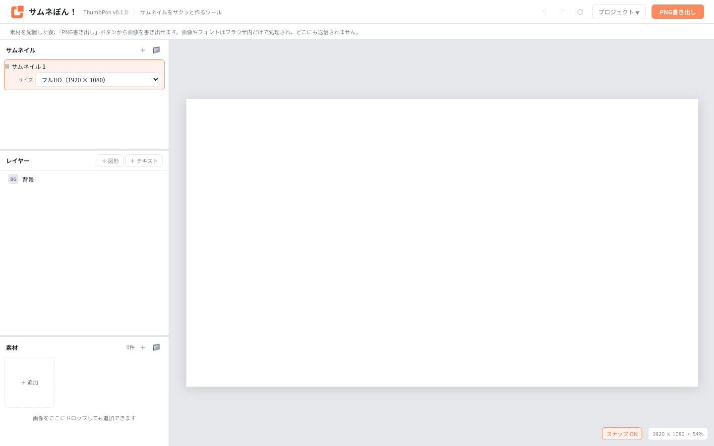
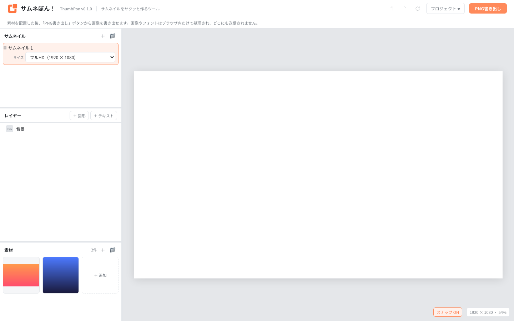
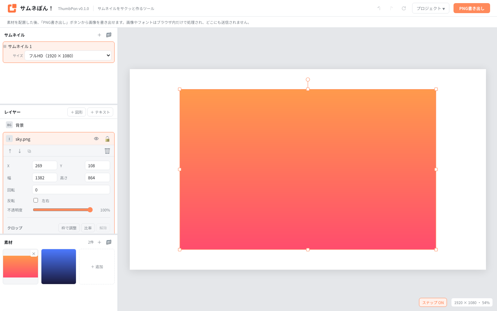
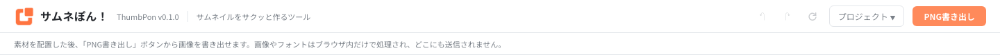
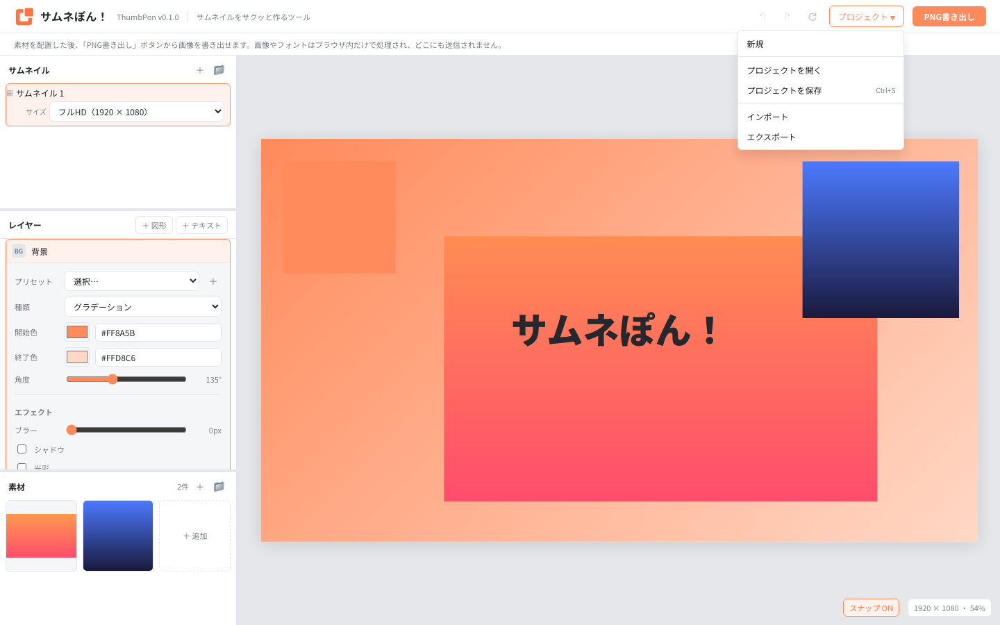
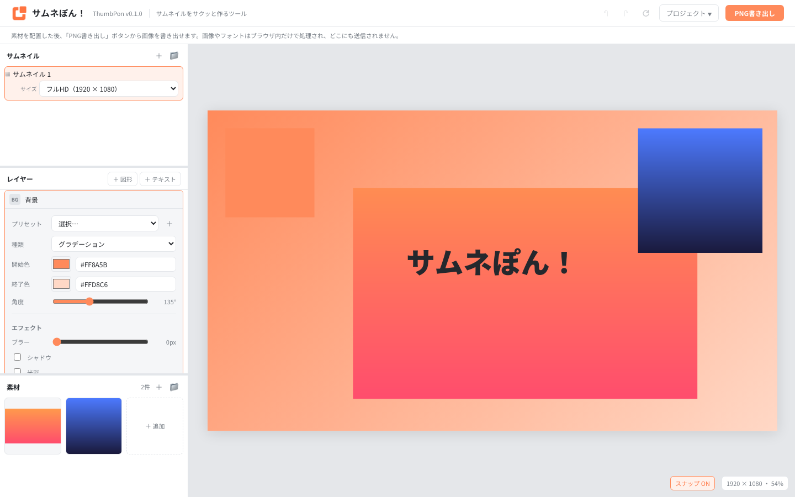

# サムネぽん / ThumbPon (開発中)


**バージョン: v0.1.0**（画面右上のツールバーにも表示されます）

画像やテキストなどの素材を配置し、**サムネイル画像を効率よく制作する**ためのWebツールです。

DCCツールを毎回開かずに、シンプルなレイアウトの画像をサクッと作ることを目的にしています。<br>
自由度よりも、速さ・軽さ・操作の少なさを優先しています。

読み込み・編集・保存・書き出しはすべてブラウザ内で完結し、画像やフォントは**サーバーに送信されません**。<br>

## できること

- 複数のサムネイルを作成し、フォルダで整理する
- 画像・テキスト・背景をキャンバスへ配置して編集する
- レイヤーの移動、拡大縮小、回転、クロップ、重なり順の変更
- ローカル素材・フォント・テキストの利用
- PNGファイルの書き出し
- プロジェクトファイルの入出力・ローカルフォルダ保存（Chromium系のみ）

## 画面構成


- **サムネイル**: 制作物ごとの切替、追加、フォルダ整理、キャンバスサイズの変更
- **レイヤー**: 背景・画像・テキストの選択、並び替え、詳細編集
- **素材**: 画像の登録とフォルダ整理
- **キャンバス**: 配置・リサイズ・回転・クロップなどの直接操作

## 基本的な使い方

### サムネイル編集・画像書き出し

#### 1. サムネイルを選び、サイズを決める



- 左上の「サムネイル」パネルで、編集するサムネイルを選びます。
- 必要なら `＋` で追加し、選択中の行から用途に合うキャンバスサイズを選びます。
- 用途ごとのサイズ一覧は[詳しい使い方のキャンバスサイズ](#キャンバスサイズ)を参照してください。

#### 2. 素材を追加する



| 素材 | 追加方法 |
| --- | --- |
| 画像 | キャンバスへドラッグ&ドロップ。素材パネルの画像はクリックで中央に、ドラッグで任意の位置に配置 |
| テキスト | 「レイヤー」パネルの `＋ テキスト` を押し、プロパティで内容・フォント・サイズ・色を設定 |
| 図形 | 「レイヤー」パネルの `＋ 図形` を押し、プロパティで形や塗りを設定 |

#### 3. 配置と見た目を整える



- キャンバス上でレイヤーをドラッグして動かします。
- 選択枠のハンドルで大きさや回転を調整し、レイヤー一覧をドラッグして前後関係を変更します。
- 背景は一覧最上部の `BG 背景` から編集します。

#### 4. 画像を書き出す



- PNGファイルとしての書き出しをサポートしています。
- 完成したら画面右上の `PNG書き出し` を押します。表示倍率に関係なく、キャンバス実寸の PNG がダウンロードされます。

### プロジェクトの保存



プロジェクトの保存方法として、次の2つを用意しています。

| 方法 | 特徴 |
| --- | --- |
| ローカルフォルダを指定して保存 | 作業フォルダへ直接保存し、次回もそのフォルダを開いて再開する。**Chrome / Edge など Chromium 系のみ** |
| エクスポート／インポート | `.thumbpon.zip` ファイルとして保存し、ファイルから再開する。全ブラウザ対応 |

#### ローカルフォルダを指定して保存する（Chromium 系のみ）

1. 「プロジェクト」→「プロジェクトを保存」を選びます。初回だけ保存先のフォルダを選択します。
2. 次回からは `Ctrl` / `⌘` + `S` でも、同じフォルダへ保存できます。
3. 作業を再開するときは、「プロジェクト」→「プロジェクトを開く」で保存先のフォルダを選びます。

#### エクスポート／インポートする

1. 「プロジェクト」→「エクスポート」を選び、`.thumbpon.zip` をダウンロードします。
2. 作業を再開するときは、「プロジェクト」→「インポート」からそのファイルを読み込みます。

## 詳しい使い方

### サムネイルと素材の整理


1枚の制作物が「サムネイル」です。複数作成してフォルダで分類できます。

| 操作 | 方法 |
| --- | --- |
| 切り替え | 行をクリック |
| 名前変更 | 行をダブルクリック |
| 追加 | パネル右上の `＋`。フォルダ行の `＋` ならそのフォルダ内へ追加 |
| 複製 | 行にホバーして `⧉` |
| コピー／貼り付け | 行の `📋` でコピーし、パネル右上またはフォルダ行の `📥` で貼り付け |
| フォルダへ移動 | 行をフォルダへドラッグ |
| 削除 | 行の `🗑`。削除後はひとつ上のサムネイルへ移動 |

キャンバスサイズはサムネイルごとに保持します。選択中の行の下にある `サイズ` から変更してください。

#### キャンバスサイズ

| 用途 | サイズ |
| --- | --- |
| フルHD | `1920 × 1080` |
| HD | `1280 × 720` |
| 4:3 | `800 × 600` |
| Reels / Shorts / TikTok | `1080 × 1920` |
| X 投稿 | `1600 × 900` |
| Instagram 投稿 | `1080 × 1350` |
| Instagram 正方形 | `1080 × 1080` |
| OGP / Facebook | `1200 × 630` |

一覧にないサイズは `カスタム` から幅と高さを指定できます。

#### 素材の整理

| 項目 | 内容 |
| --- | --- |
| 追加方法 | キャンバスへの直接ドロップ、または素材パネルから追加 |
| 対応形式 | PNG、JPEG、WebP、SVG |
| 保存先 | IndexedDB（リロード後も残る） |
| フォルダ分け | パネル右上の `📁` でフォルダを追加し、素材タイルをドラッグして分類 |

フォルダを削除しても中の素材は未分類へ戻るだけで、画像自体は消えません。素材フォルダの分類は、プロジェクトを書き出したときの `assets/` 内のフォルダ構成にも反映されます。

### クロップと左右反転


画像レイヤーは表示する範囲を切り詰められます。切り落とす量は割合で持つため、レイヤーを拡大縮小してもクロップは崩れません。

| 操作 | 方法 |
| --- | --- |
| 枠をドラッグして調整 | プロパティの `枠で調整` を押し、キャンバス上の8つのハンドルで枠を内側へ詰める（切り落とす部分は薄く表示） |
| スライダーで調整 | `上/下/左/右を切る` のスライダーを操作。`解除` で画像全体へ戻る |
| 右クリックから調整 | レイヤー一覧またはキャンバス上で右クリック →「クロップを調整」 |
| 左右反転 | `反転` → `左右`、または右クリックメニューの `左右反転`。枠は動かさず中身だけ鏡像にする（クロップ中も見た目のまま反転） |

### レイヤー操作


| 操作 | 方法 |
| --- | --- |
| 重なり順の変更 | 一覧をドラッグ、または右クリックメニューで最前面・最背面へ移動（**一覧の下にあるレイヤーほど前面**） |
| 移動 | キャンバス上でドラッグ、または矢印キーで 1px・`Shift` + 矢印キーで 10px |
| リサイズ／回転 | キャンバス上の8つのハンドルでリサイズ、上のハンドルで回転 |
| 削除 | `Delete` / `Backspace` |
| 軸固定・比率維持 | `Shift` を押しながら移動・拡大縮小・回転（15度単位） |
| 表示切替／ロック | 行の `👁` / `🔓` |
| スナップ | 有効時はキャンバスと他レイヤーの端・中央へ吸着（マゼンタのガイド線）。`Alt` で一時無効、キャンバス右下のボタンで ON/OFF |

右クリックメニューでは、前後への移動、複製、表示切替、ロック、左右反転、クロップ、削除をまとめて操作できます。<br>
ロック中のレイヤーはキャンバスでは掴めないため、一覧から操作してください。回転しているレイヤーはスナップ対象外です。

### 画像、テキスト、背景


| 種別 | 設定できること |
| --- | --- |
| 画像 | 表示／ロック、透明度、左右反転、クロップ、ブラー・シャドウ・光彩 |
| テキスト | 内容、フォント、文字サイズ、太さ、揃え、色、字間、行間、縁取り、エフェクト |
| 背景 | 単色、グラデーション、画像、パターン（`cover` / `contain` / タイル表示に対応） |
| プリセット | テキストスタイルと背景設定を名前付きで保存し、別のサムネイルへ再利用 |

テキストレイヤーでは、左右のハンドルで折り返し幅、コーナーのハンドルで文字サイズを比例して変更できます。



背景の種類と設定は次のとおりです。

| 種類 | 設定できること |
| --- | --- |
| 単色 | 色 |
| グラデーション | 開始色・終了色・角度 |
| 画像 | 素材、`cover` / `contain` / タイル、位置、下地色 |
| パターン | 水玉／ライン／チェック、間隔、色、太さ、角度、下地色 |

ブラー、シャドウ、光彩は画像・テキスト・背景に適用できます。影と光彩は矩形ではなく、文字や透過画像など中身の形に沿って表示されます。

### フォント

| 項目 | 内容 |
| --- | --- |
| PC フォント | Chromium 系ブラウザでは、インストール済みのフォントを読み込める |
| フォントファイル追加 | `.ttf` / `.otf` / `.woff` / `.woff2` を追加でき、ブラウザ内へ保存される |
| プロジェクトへの同梱 | しない。別環境でプロジェクトを開くときは同じフォントを改めて読み込む |

### PNG を書き出す


画面右上の `PNG書き出し` を押すと、現在のサムネイルを PNG としてダウンロードできます。表示倍率に関係なくキャンバス実寸で出力され、ファイル名にはサムネイル名を使います。

### プロジェクトを保存・受け渡す


ブラウザ内の自動保存は復旧用です。リロード後も作業内容を復元できますが、他の端末への受け渡しやバックアップには、ブラウザに応じて次の方法を使ってください。

| ブラウザ | 保存と再開の方法 |
| --- | --- |
| Chrome / Edge など Chromium 系 | 「プロジェクトを保存」でローカルフォルダを選ぶ。以後は `Ctrl` / `⌘` + `S` で保存し、「プロジェクトを開く」で再開する |
| Firefox / Safari / モバイルなど | 「エクスポート」で `.thumbpon.zip` をダウンロードし、「インポート」で再開する |

ローカルフォルダ連携は File System Access API を使うため、Chrome / Edge など Chromium 系ブラウザのみで使えます。

#### ローカルフォルダをワークスペースにする

初回の「プロジェクトを保存」で保存先フォルダを選ぶと、そのフォルダが以後の作業場所になります。以後の保存はダイアログなしで反映され、素材は増減した分だけ書き込まれます。<br>
リロード時には同じフォルダへ再接続しますが、ブラウザが権限を忘れた場合は画面上部の案内から再接続してください。

```
選んだフォルダ/
  夜景シリーズ.thumbpon   サムネイル・レイヤー・プリセットなどの JSON
  assets/                 素材画像
    背景素材/             素材パネルのフォルダごとに分類
```

「プロジェクトを開く」では `.thumbpon` ファイルではなく、そのファイルと `assets/` を含む**フォルダ**を選びます。<br>
別のプロジェクトを読み込みたいときは「プロジェクトを開く」を使い、「保存」で現在の内容を別フォルダへ上書きしないようにしてください。

#### ファイルとして受け渡す

「エクスポート」は、マニフェストと素材を `.thumbpon.zip` 1つにまとめます。画像は再圧縮しないため、容量は素材の合計とほぼ同じです。<br>
解凍したフォルダは「プロジェクトを開く」で開け、ワークスペースフォルダを ZIP にしたものも「インポート」で読み込めます。<br>
インポート後は、誤って以前のフォルダを上書きしないようワークスペース接続を解除します。

フォルダに接続している間はフォルダ側の内容を正として、起動時にそちらを読み込みます。

## 開発者向け

開発には Node.js と npm が必要です。依存パッケージと実行スクリプトは `package.json` を正とします。

```bash
npm install
npm run dev        # 開発サーバー（http://localhost:5173）
npm run typecheck  # 型チェック
npm run test       # ユニットテスト
npm run format     # Prettier 整形
```

### README のスクリーンショット

`samples/readme-sample/` はスクリーンショット用のサンプルプロジェクトです（ワークスペースフォルダ形式。「プロジェクトを開く」でそのまま開けます）。<br>
`docs/readme/` の画像は、開発サーバーを起動した状態で次のスクリプトから撮り直せます。Playwright は依存に含めていないため、別途用意してください。

```bash
npm run dev   # 別ターミナルで起動しておく
npm i --no-save playwright && npx playwright install chromium
node scripts/capture-readme.mjs
```

### ビルド

```bash
npm run build      # tsc --noEmit && vite build。出力先は dist/
npm run preview    # ビルド結果をローカルで確認
```

`npm run build` は型チェックに失敗すると止まります。`dist/` にはブラウザ内で完結する静的な HTML / CSS / JS だけが出力され、サーバー側の処理は一切含みません。

### デプロイ

ThumbPon は読み込み・編集・保存・書き出しがすべてブラウザ内で完結する静的サイトです。`npm run build` で生成した `dist/` の中身を、そのまま任意の静的ホスティングへ配置するだけで動作します（GitHub Pages、Netlify、Vercel、Cloudflare Pages、S3 + CloudFront など）。

- ルート直下（`https://example.com/`）に配置する場合は追加設定不要です。
- `https://example.com/thumbpon/` のようなサブパスへ配置する場合は、`vite.config.ts` に `base: '/thumbpon/'` を追加してから再ビルドしてください。
- 本リポジトリには特定サービス向けのデプロイ設定（CI/CD 等）は含まれていません。必要に応じて利用するホスティング先の手順に従ってください。

アーキテクチャとコード規約は以下にまとめています。

- [現行仕様](docs/spec/thumbpon-spec.md)
- [基本コーディング規約](docs/instructions/code_guide.md)
- [アーキテクチャガイド](docs/instructions/architecture_guide.md)
