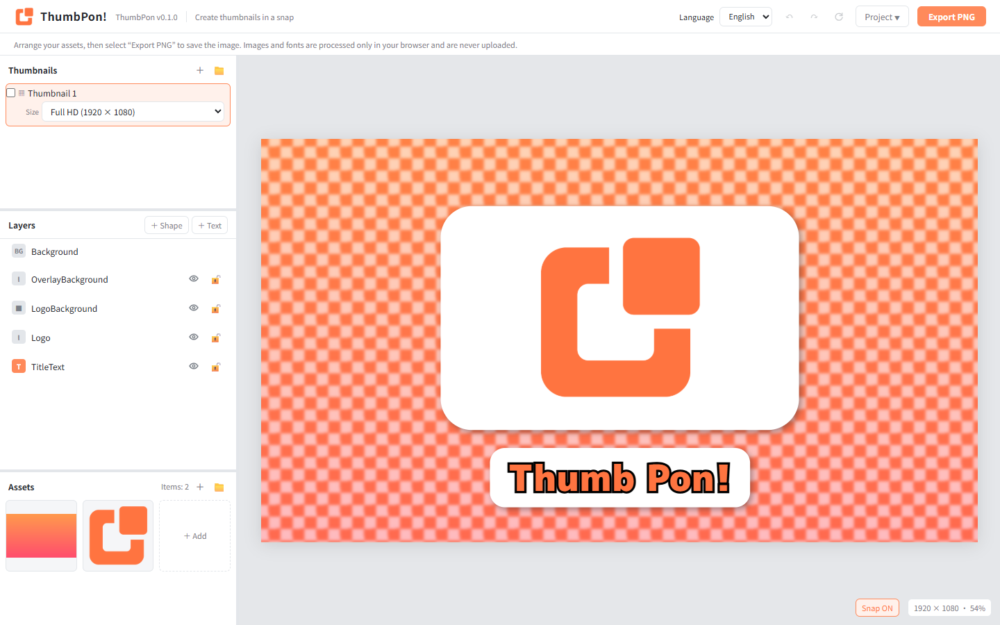
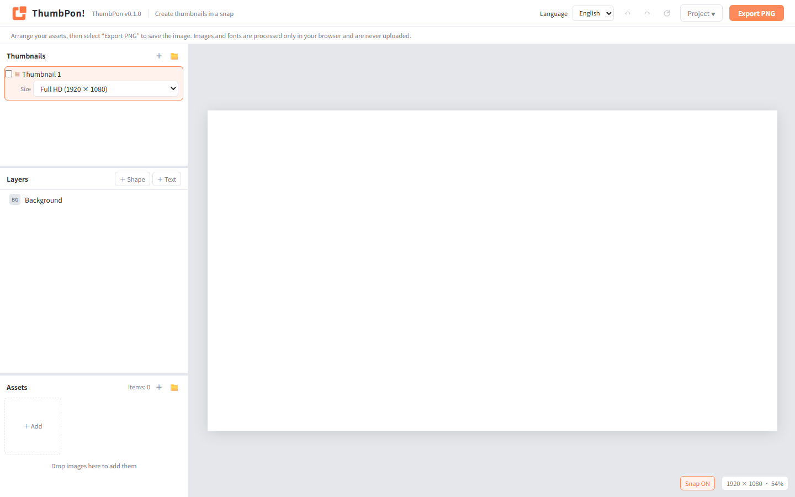
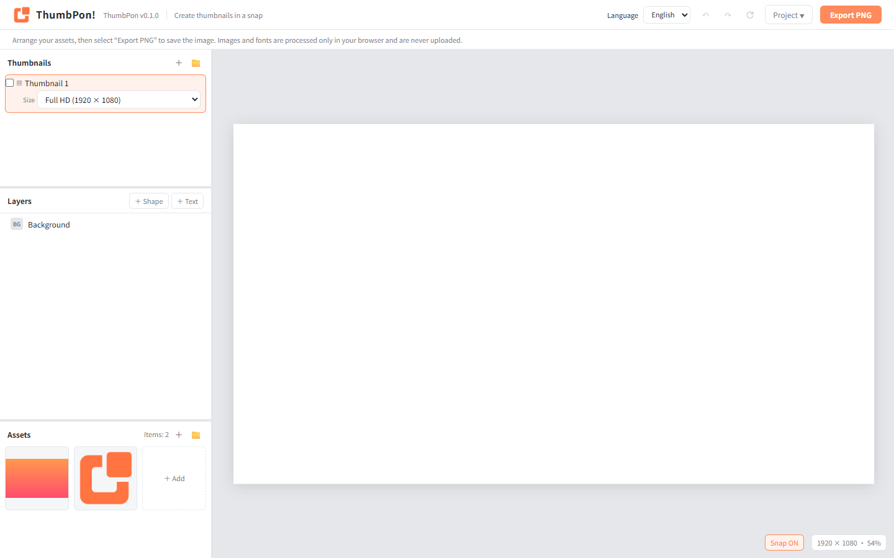
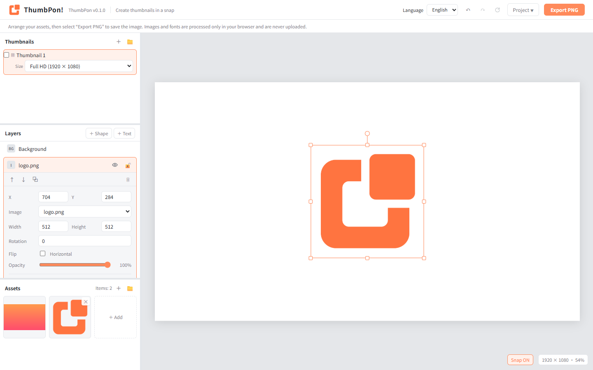
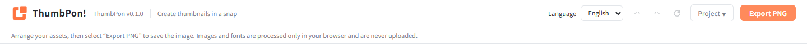
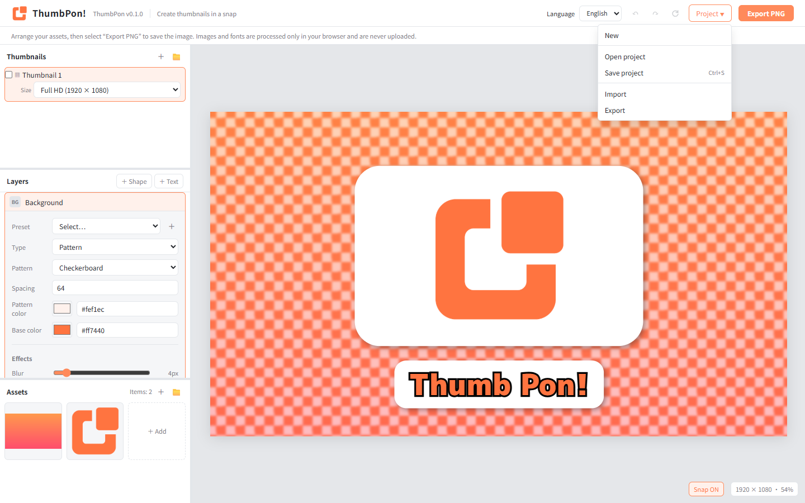
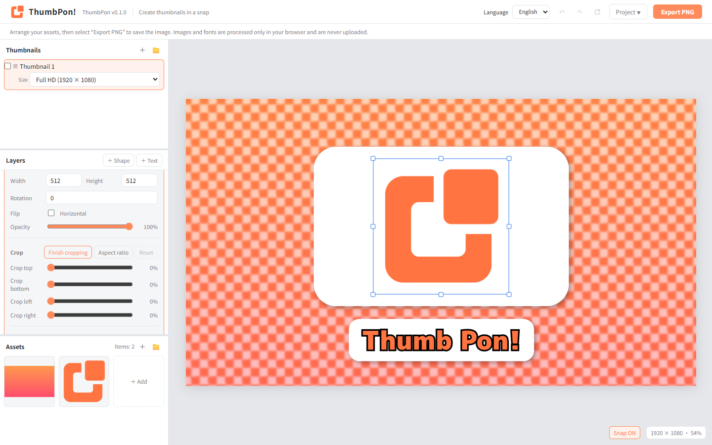
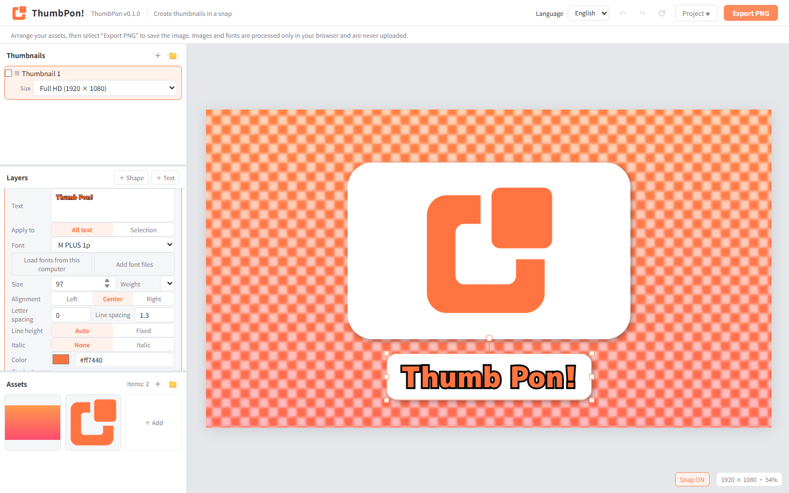
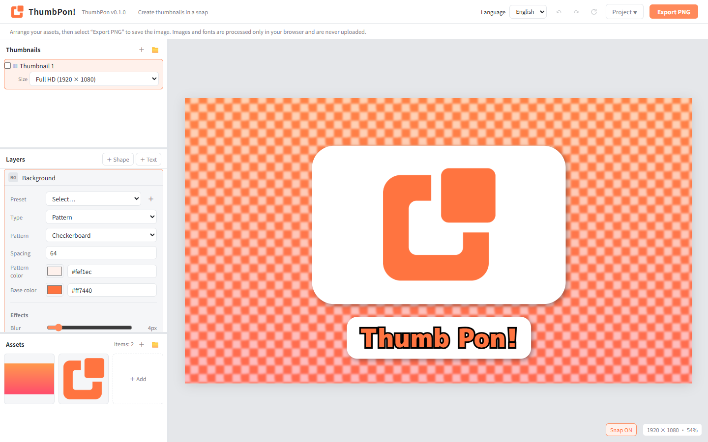

English · [日本語](README.ja.md)

# ThumbPon (in development)


A web tool for **creating thumbnail images efficiently** by arranging images, text, and other assets.

ThumbPon helps you put together simple image layouts quickly, without opening a full DCC application each time.<br>
It prioritizes speed, a lightweight workflow, and fewer steps.

Importing, editing, saving, and exporting all happen in your browser. Images and font files are **never uploaded to a server**.<br>
Built-in web fonts are fetched from Google Fonts, so loading them involves a connection to Google. Your edits and added local fonts are not sent.<br>

## Features

- Create multiple thumbnails and organize them in folders
- Place and edit images, text, and backgrounds on the canvas
- Move, resize, rotate, crop, and reorder layers
- Use local assets, fonts, and text
- Export PNG files
- Import and export project files, or save to a local folder (Chromium browsers only)

## Interface



- **Thumbnails**: Switch between designs, add thumbnails, organize folders, and change canvas sizes
- **Layers**: Select, reorder, and edit backgrounds, images, and text
- **Assets**: Import images and organize them in folders
- **Canvas**: Arrange, resize, rotate, and crop layers directly

## Getting started

### Interface language

Switch between English and Japanese in the header. Add `?lang=en` to the app URL to open it in English, or `?lang=ja` for Japanese. If the URL already has a query string, use `&lang=en`, for example.

The URL setting takes priority over the saved preference and is saved for your next visit. Without a URL setting, the app uses the saved language, or Japanese if no preference has been saved.

### Editing thumbnails and exporting images

#### 1. Choose a thumbnail and canvas size



- Select the thumbnail you want to edit in the **Thumbnails** panel at the top left.
- Add one with `＋` if needed, then choose a canvas size in the selected row.
- See [Canvas sizes](#canvas-sizes) for the available size presets.

#### 2. Add assets



| Asset | How to add it |
| --- | --- |
| Image | Drag and drop onto the canvas. Click an image in the Assets panel to place it in the center, or drag it to a specific position |
| Text | Click `＋ Text` in the Layers panel, then set the content, font, size, and color in its properties |
| Shape | Click `＋ Shape` in the Layers panel, then set the shape and fill in its properties |

#### 3. Adjust the layout and appearance



- Drag layers on the canvas to move them.
- Use the selection handles to resize or rotate a layer, and drag layers in the list to change their stacking order.
- Edit the background through `BG Background` at the top of the layer list.

#### 4. Export the image



- Images can be exported as PNG files.
- When you are finished, click `Export PNG` at the top right. The downloaded PNG uses the actual canvas dimensions, regardless of the current zoom level.

### Saving projects



There are two ways to save a project.

| Method | Details |
| --- | --- |
| Save to a local folder | Save directly to a working folder and reopen that folder to resume. **Chromium browsers such as Chrome and Edge only** |
| Export / Import | Save as a `.thumbpon.zip` file and import it to resume. Available in all browsers |

#### Save to a local folder (Chromium browsers only)

1. Choose **Project → Save project**. Select a destination folder the first time.
2. On subsequent saves, you can also use `Ctrl` / `⌘` + `S` to save to the same folder.
3. To resume editing, choose **Project → Open project** and select the saved folder.

#### Export / Import

1. Choose **Project → Export** to download a `.thumbpon.zip` file.
2. To resume editing, choose **Project → Import** and select that file.

## Detailed usage

### Organizing thumbnails and assets


Each design is a thumbnail. You can create multiple thumbnails and organize them in folders.

| Action | How |
| --- | --- |
| Switch | Click a row |
| Rename | Double-click a row |
| Add | Click `＋` at the top right of the panel. The `＋` on a folder row adds a thumbnail inside that folder |
| Duplicate | Hover over a row and click `⧉` |
| Copy / Paste | Use `📋` on a row to copy, then `📥` at the top right of the panel or on a folder row to paste |
| Move to a folder | Drag a row into a folder |
| Delete | Click `🗑` on the row. The thumbnail above it becomes active after deletion |

Canvas sizes are saved per thumbnail. Change the size using `Size` below the selected row.

#### Canvas sizes

| Use | Size |
| --- | --- |
| Full HD | `1920 × 1080` |
| HD | `1280 × 720` |
| 4:3 | `800 × 600` |
| Reels / Shorts / TikTok | `1080 × 1920` |
| X post | `1600 × 900` |
| Instagram post | `1080 × 1350` |
| Instagram square | `1080 × 1080` |
| OGP / Facebook | `1200 × 630` |

Choose `Custom` to enter a width and height that are not in the preset list.

#### Organizing assets

| Item | Details |
| --- | --- |
| Adding images | Drop directly onto the canvas, or add through the Assets panel |
| Supported formats | PNG, JPEG, WebP, SVG |
| Storage | IndexedDB (assets persist after reloading) |
| Folders | Click `📁` at the top right of the panel to add a folder, then drag asset tiles into it |

Deleting a folder moves its assets back to the unfiled area without deleting the images. Asset folders are also reflected in the `assets/` directory structure when exporting a project.

### Cropping and horizontal flipping



You can trim the visible area of an image layer. Crop amounts are stored as proportions, so resizing a layer preserves its crop.

| Action | How |
| --- | --- |
| Adjust the frame | Click `Adjust frame` in the properties, then drag the eight handles inward on the canvas. The cropped-out area appears faded |
| Use sliders | Adjust `Crop top`, `Crop bottom`, `Crop left`, and `Crop right`. Click `Reset` to show the whole image |
| Use the context menu | Right-click the layer in the list or on the canvas, then choose **Adjust crop** |
| Flip horizontally | Use **Flip → Horizontal**, or choose **Flip horizontally** from the context menu. The frame stays in place while its contents are mirrored, including during cropping |

### Working with layers


| Action | How |
| --- | --- |
| Change stacking order | Drag in the list, or choose **Bring to front** / **Send to back** from the context menu. **Layers lower in the list appear in front** |
| Move | Drag on the canvas, or use the arrow keys for 1 px steps and `Shift` + arrow keys for 10 px steps |
| Resize / Rotate | Use the eight selection handles to resize, or the handle above the layer to rotate |
| Delete | `Delete` / `Backspace` |
| Constrain movement / Preserve aspect ratio | Hold `Shift` while moving, resizing, or rotating (rotation snaps to 15° increments) |
| Toggle visibility / Lock | Use `👁` / `🔓` on the row |
| Snap | When enabled, layers snap to the edges and centers of the canvas and other layers, with magenta guides. Hold `Alt` to temporarily disable snapping; toggle it with the button at the bottom right of the canvas |

The context menu provides stacking controls, duplication, visibility, locking, horizontal flipping, cropping, and deletion.<br>
Locked layers cannot be grabbed on the canvas; use the list to work with them. Rotated layers do not participate in snapping.

### Images, text, and backgrounds



| Type | Available settings |
| --- | --- |
| Image | Visibility, locking, opacity, horizontal flipping, cropping, blur, shadow, and glow |
| Text | Content, font, size, weight, alignment, color, letter spacing, line spacing, outlines, and effects |
| Background | Solid color, gradient, image, or pattern; image backgrounds support `cover`, `contain`, and tiling |
| Presets | Save named text styles and background settings to reuse in other thumbnails |

For text layers, the left and right handles change the wrapping width. Corner handles scale the font size proportionally.



Background types provide the following settings.

| Type | Available settings |
| --- | --- |
| Solid color | Color |
| Gradient | Start color, end color, and angle |
| Image | Asset, `cover` / `contain` / tiling, position, and base color |
| Pattern | Dots / lines / checkerboard, spacing, color, weight, angle, and base color |

Blur, shadow, and glow can be applied to images, text, and backgrounds. Shadows and glows follow the shape of the content, such as letters or transparent images, rather than a rectangular bounding box.

### Fonts

| Item | Details |
| --- | --- |
| Built-in web fonts | Noto Sans JP / M PLUS 1p / M PLUS 2 / Roboto. Loaded from Google Fonts and available immediately, even when not installed on your computer |
| Computer fonts | Chromium browsers can load fonts installed on your computer |
| Add font files | Add `.ttf`, `.otf`, `.woff`, or `.woff2` files and store them in the browser |
| Project portability | Font files are not bundled with projects. Built-in web fonts load automatically on other devices; computer fonts and added files must be loaded again |

The first web font download requires an internet connection. If loading fails, the browser uses a fallback font. Regular, bold, and black weights (400 / 700 / 900) are loaded; Roboto also includes italic styles. The browser synthesizes italics for M PLUS 1p, M PLUS 2, and Noto Sans JP. Characters absent from Roboto, including Japanese characters, use fallback fonts.

The Google Fonts versions of these four families use the SIL Open Font License 1.1 (OFL-1.1). Copyright notices and complete license texts are included in [Web font licenses](docs/spec/web-fonts.md) and `public/licenses/fonts/`, and are included in the published build. You can use these fonts in commercial thumbnails without adding a font license notice to the exported PNG. Check the license of each local font you add.

### Exporting PNG files


Click `Export PNG` at the top right to download the current thumbnail as a PNG. The output uses the actual canvas dimensions regardless of zoom, and the filename is based on the thumbnail name.

### Saving and sharing projects


Automatic browser storage is intended for recovery. It restores your work after reloading, but for backups or transfer to another device, use one of the following methods.

| Browser | Save and resume |
| --- | --- |
| Chromium browsers such as Chrome / Edge | Use **Save project** to choose a local folder. Save again with `Ctrl` / `⌘` + `S`, and resume with **Open project** |
| Firefox / Safari and other browsers | Use **Export** to download a `.thumbpon.zip` file, then **Import** to resume |

Local folder integration uses the File System Access API and is available only in Chromium browsers such as Chrome and Edge.

#### Using a local folder as your workspace

The folder selected during the first **Save project** operation becomes your workspace. Later saves write directly to it without a dialog, and assets are written only as they are added or removed.<br>
After reloading, the app reconnects to the same folder. If the browser has forgotten the permission, use the prompt at the top of the screen to reconnect.

```text
Selected folder/
  Night series.thumbpon   JSON for thumbnails, layers, presets, etc.
  assets/                 Image assets
    Background assets/    Organized by folders in the Assets panel
```

With **Open project**, select the **folder** containing the `.thumbpon` file and `assets/`, rather than selecting the `.thumbpon` file itself.<br>
Use **Open project** to switch to another project. Avoid using **Save project** to overwrite a different project's folder with your current work.

#### Sharing as a file

**Export** packages the manifest and assets into a single `.thumbpon.zip` file. Images are not recompressed, so the archive size is roughly the total size of the assets.<br>
You can open an extracted folder with **Open project**, and import a ZIP made from a workspace folder with **Import**.<br>
Importing disconnects the existing workspace to prevent accidentally overwriting its contents.

While a folder is connected, its contents are treated as the source of truth and loaded when the app starts.

## Development

Development requires Node.js and npm. Refer to `package.json` for dependencies and scripts.

```bash
npm install
npm run dev        # Development server (http://localhost:5173)
npm run typecheck  # Type checking
npm run test       # Unit tests
npm run format     # Prettier formatting
```

### README screenshots

`samples/readme-sample/` is the sample project used for screenshots. It uses the workspace folder format and can be opened directly through **Open project**.<br>
With the development server running, use the following script to recapture screenshots. Playwright is not included as a dependency and must be installed separately.

```bash
npm run dev   # Run in a separate terminal
npm i --no-save playwright && npx playwright install chromium
node scripts/capture-readme.mjs --lang=en  # English UI: docs/readme/en/
node scripts/capture-readme.mjs --lang=ja  # Japanese UI: docs/readme/
```

### Build

```bash
npm run build      # tsc --noEmit && vite build; output: dist/
npm run preview    # Preview the build locally
```

`npm run build` stops if type checking fails. `dist/` contains only static HTML, CSS, and JavaScript that run in the browser; no server-side processing is included.

### Deployment

ThumbPon is a static site: importing, editing, saving, and exporting all happen in the browser. Deploy the contents of `dist/` generated by `npm run build` to any static hosting service, such as GitHub Pages, Netlify, Vercel, Cloudflare Pages, or S3 + CloudFront.

- No additional configuration is required when serving at a domain root, such as `https://example.com/`.
- For a subpath such as `https://example.com/thumbpon/`, add `base: '/thumbpon/'` to `vite.config.ts` and rebuild.
- This repository does not include hosting-specific deployment or CI/CD configuration. Follow your hosting provider's deployment instructions.

Architecture and coding conventions are documented here (in Japanese):

- [Current specification](docs/spec/thumbpon-spec.md)
- [Coding guide](docs/instructions/code_guide.md)
- [Architecture guide](docs/instructions/architecture_guide.md)
